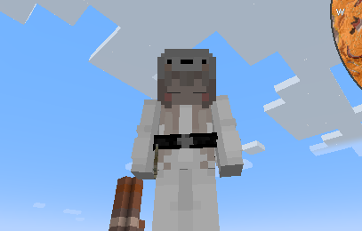

# KubeJS-Curios

Adding Trinkets by KubeJS

## A brief introduction to rendering, started with a belt

Since adding renderer to trinket is surely something not easy, I think some introduction here would be good.
Installing `ProbeJS` is recommended, so you can get those methods and fields more easily.

Here I will make a Botania-like sash item step by step, with only the render code.

### 1 Context

Before actually doing the render, getting things like models/textures to render is important. There are 12 arguments
passed in 1 call of render, which is clearly too much for any function to handle well.

So they're all wrapped up as `Context`, which is demonstrated below:

```js
onEvent("item.registry", event => {
    event.create("void_sash", "curios:trinket")
        .render(context => {
            let {
                stack,              //The itemstack of the trinket
                entity,             //The entity trinket is about to be rendered on
                
                poseStack,          //The "space" for trinket to render
                bipedModel,         //The model of the entity
                buffers,            //Where you tell GPU to do all sorts of thing, 
                                    //like stitching texture to a model or something else.
               
                ageInTicks,         //How many ticks have passed
                light,              //The surrounding light level for rendering
                partialTicks,        //A more fine-grained tick for rendering
                
                netHeadYaw,         //Your nose turn left or right
                headPitch,          //Your nose turn up or down

                limbSwing,          //Limb swing thing
                limbSwingAmount,    //How much your limb swings
            } = context;
        })
})
```

For most of the time, we only need some of them to render things well - fields can be omitted if you don't need them.
All the arguments we needed in this tutorial are as follows:

```js
onEvent("item.registry", event => {
    event.create("void_sash", "curios:trinket")
        .render(context => {
            let { 
                poseStack,          //The "space" for trinket to render
                bipedModel,         //The model of the entity
                buffers,            //Where you tell GPU to do all sorts of thing, 
                                    //like stitching texture to a model or something else.
                                    
                light,              //The surrounding light level for rendering
            } = context;
        })
})
```

### 2 Transforming the poseStack

By default, everything will be rendered at a same position, with a fixed scale. In order to render things as you need
them to be, you will need to make some changes to the `poseStack`, like scaling them up or down, or translating them by
a certain offset.

Luckily, the belt rendering is attached to the body - so we don't need to translate the `poseStack`, but only upscale
them by a bit to fit player model:

```js
poseStack.scale(1.15, 1.15, 1.15)
```

You can try to translate the stack by calling so things will be moved by `x`, `y`, `z` for a more straightforward
demonstration of how `poseStack` affects the rendering:

```js
poseStack.translate(x, y, z)
```

...Or rotating is fine, too:

```js
//The Vector3f java class is needed here to get the axis, 
//this is allowed in class filter by KubeJS Curios

let Vector3f = java("com.mojang.math.Vector3f");
poseStack.mulPose(Vector3f.XP.rotationDegrees(180))
```

There are some useful methods provided in `Curios` and `Trinkets` too, you can check them out by using `CuriosRenderer`
and `TrinketRenderer` in code (And completions would pop up if you have `ProbeJS` installed). Or read their source code
on their GitHub repos.

Even though we don't need such thing in the render code since we are doing something quite static and fixed, testing
them out can be useful for you to understand the rendering.

Finally, we will have our code like:

```js
onEvent("item.registry", event => {
    event.create("void_sash", "curios:trinket")
        .render(context => {
            let {
                poseStack, //The "space" for trinket to render
                bipedModel, //The model of the entity
                buffers,            //Where you tell GPU to do all sorts of thing, 
                                    //like stitching texture to a model or something else.
                                    
                light, //The surrounding light level for rendering
            } = context;

            poseStack.scale(1.15, 1.15, 1.15)
        })
})
```

### 3 Loading textures for a model

We are rendering belt, which is attached to the player body model - so we don't need to create our own models, just need
to stitch textures to them! So we can do like to get texture into the buffer:

```js
const beltTexture = new ResourceLocation("kubejs:textures/model/void_sash.png")
let buffer = buffers.m_6299_(bipedModel.renderType(beltTexture))
```

This line feeds the texture location to the model we're rendering to get the `RenderType`, and then pass it to
the `buffers.m_6299_` to get the loaded model texture.

The method name should be `getType`, but it is obfuscated and not remappable by Rhino, so we will have to use the
obfuscated name directly. You can check out the `void_sash.png` at [here](examples/void_sash.png). Note the similarity
between it and other armor model textures, since we're rendering it on a player model, their textures would be similar.

Our code looks like this now:

```js
onEvent("item.registry", event => {
    //Put the constants outside so your code would be more clear.
    const beltTexture = new ResourceLocation("kubejs:textures/model/void_sash.png")
    event.create("void_sash", "curios:trinket")
        .render(context => {
            let {
                poseStack, //The "space" for trinket to render
                bipedModel, //The model of the entity
                buffers,            //Where you tell GPU to do all sorts of thing, 
                                    //like stitching texture to a model or something else.
                                    
                light, //The surrounding light level for rendering
            } = context;

            poseStack.scale(1.15, 1.15, 1.15)
            let buffer = buffers.m_6299_(bipedModel.renderType(beltTexture))
        })
})
```

### 4 Rendering

And so we have the textures loaded, the last step is to actually render them:

```js
const NO_OVERLAY = (0 | 10 << 16)
bipedModel.body.render(poseStack, buffer, light, NO_OVERLAY, 1, 1, 1, 1)
```

Here we render the belt by passing our transformed `poseStack`, the `buffer` containing our model texture, the `light`
level in rendering, and a bunch of other parameters. We stitched the model to body by calling `render`
of `bipedModel.body`, so the rendering of the belt would go with how player's body move - no matter you're swimming,
running or sneaking or doing other kinds of moves.

There are other ways of rendering, too, like render the item stack directly:

```js
Client.getMinecraft().getItemRenderer()
    .renderStatic(
        stack, "none",
        light, NO_OVERLAY,
        poseStack, buffers, 0
    )
```

Where the `stack` is the item stack, or any other item stack you created. The `none` here tells Minecraft that how you
want to transform the item model - like as in hand, on an Item Frame or others.

Back to the topic, we should have our final code looking like:

```js
onEvent("item.registry", event => {
    //Put the constants outside so your code would be more clear.
    const beltTexture = new ResourceLocation("kubejs:textures/model/void_sash.png")
    const NO_OVERLAY = (0 | 10 << 16)
    event.create("void_sash", "curios:trinket")
        .render(context => {
            let {
                poseStack, //The "space" for trinket to render
                bipedModel, //The model of the entity
                buffers,            //Where you tell GPU to do all sorts of thing, 
                                    //like stitching texture to a model or something else.
                                    
                light, //The surrounding light level for rendering
            } = context;

            poseStack.scale(1.15, 1.15, 1.15)
            let buffer = buffers.m_6299_(bipedModel.renderType(beltTexture))
            bipedModel.body.render(poseStack, buffer, light, NO_OVERLAY, 1, 1, 1, 1)
        })
})
```

With everything in place (including the model texture in assets folder), you should look like:

